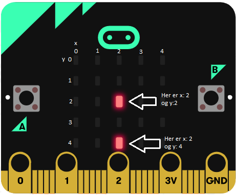
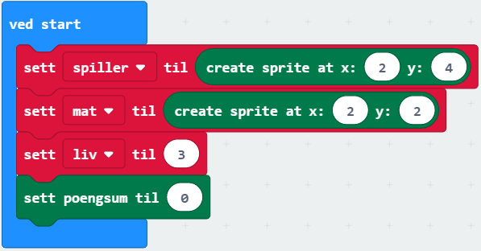
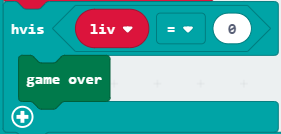
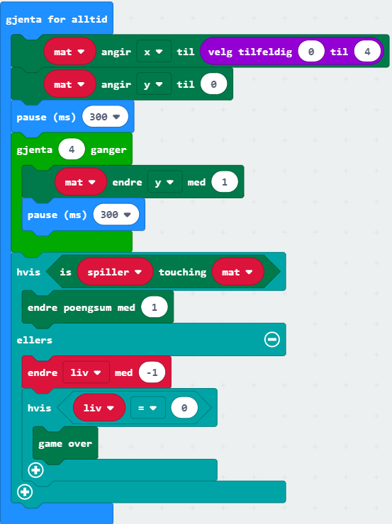

# Introduksjon {.intro} 

Det regner mat! er et spill som går ut på å fange flest mulig matbiter. Det fungerer slik at matbiter faller ned på skjermen og spilleren som står på bunn skal prøve å fange maten ved å bevege seg med knappene A og B. Liv går tapt når spilleren ikke klarer å få tak i maten. Spilleren har til sammen tre liv før spillet er over.  

# Steg 1: Grunnlag {.activity}

*Det første vi skal gjøre er å kode grunnlaget for spillet. Vi skal lage mat, en spiller og sette antall liv. Vi må også starte opp noe som holder kontroll på poengsummen.*

## Sjekkliste {.check}

- [ ] Lag tre variabler `spiller`, `mat` og `liv` med `Lag en variabel...` i kategorien `Variabler`. 

Skjermen vår består av 5x5 ledlys. Disse kan vi skru av og på med litt kode. I denne oppgaven bruker vi klosser fra `Spill`-kategorien til å sette og endre hvor lysene skal være. Posisjonen til lysene blir gitt med en x- og en y-posisjon som i et rutenett. X angir plassen til lyset bortover og y angir plassen nedover, dette er vist på bilder under. 
	

- [ ] Spilleren skal bevege seg på nederste rad til høyre og venstre. For å få spilleren til være på midten ved starten av spillet, gjør vi som vist under og setter variabelen `spiller` til punktet x: 2 og y: 4. `Create sprite at x: 2 y: 2`-klossen finner du i kategorien `Spill` i `Avansert`. Koden skal settes i `ved start`-klossen som allerede finnes i kodefeltet ditt (eller du kan finne den i `Basis`-kategorien). 

	

- [ ] Gjør det samme med vaiabelen `mat` som du gjorde med variabelen `spiller` i punktet over. Den eneste forskjellen er at `mat` skal settes til x: 2 og y: 2. 

## {.tip}
Det er egentlig ikke så viktig hvor vi plasserer `mat` ved starten siden den kommer til å flytte på seg i neste steg. Det som er viktig er at `mat` finnes på spillebrettet ved start slik at det går an å bruke variabelen senere.
##

- [ ] Sett variabelen `liv` til 3. Klossen du skal bruke finner du i `Variabler`.

- [ ] Ved start skal også poengsum settes til 0. Du finner en kloss som gjør dette i `Spill`-kategorien.

- [ ] Dersom du har gjort alt rett så vil koden din se slik ut:

	

## {.tip}

Både `mat` og `spiller` blir et ledlys hver på micro:biten. Hvis du vil skille litt mer mellom dem kan du få maten til å lyse litt mindre enn spilleren. Dette gjør du ved å sette  -klossen etter `sett poengsum til 0`. Bytt ut `sprite` med `mat` og `x` med `lysstyrke`. Det er litt forskjell på hvordan simulatoren og micro:biten opplever lysstyrke, så imens du er i simulaturen setter du lysstyrke til 100. Når du laster spillet opp til micro:biten, endre lysstyrken til 30.

# Steg 2: Mat regner {.activity}

*I dette steget skal vi få maten til å regne ned. Maten skal starte på et tilfeldig sted på øverste rad hver runde.*

## Sjekkliste {.check}

- [ ] I `gjenta for alltid`-klossen, sett inn  som du finner i `Spill`. `Gjenta for alltid`-klossen finnes allerede på kodefeltet ditt eller du kan finne den i `Basis`.  Sett inn variabelen `mat` i stedenfor `sprite`. 0 bytter du ut med `plukk et tilfeldig tall mellom 0 og 4`-klossen være som du finner i kategorien `Matematikk`. 

- [ ] Sett inn en til `sprite angir x til 0` -kloss under den forrige, men i steden for x skal det stå y. 

- [ ] Sett inn en `pause`-kloss. Den finner du i `Basis`. Endre tallet til 300. Dette gir oss litt tid fra maten blir satt øverst til den begynner å regne.

Det vi har gjort til nå i steget er å ha satt `mat` til en tilfeldig x-posisjon (et tilfeldig sted bortover). Vi har i tillegg passet på at `mat` starter på øverste rad for hver runde. Det vi nå skal gjøre, er å lage kode som gjør at maten skal regne ned.  

- [ ] Finn en `gjenta 4 ganger`-kloss i `Løkker` og plasser den under `pause`-klossen. 

- [ ] For å få maten til å regne nedover, må vi endre posisjonen til variabelen `mat` i y-retning. Vi endrer posisjonen med 1 for hver gang vi går gjennom løkka. Legg til koden under i `gjenta 4 ganger`-klossen. 

	

## {.tip}
Hvis vi ikke legger til en `pause`-kloss vil maten bevege seg for fort til at vi klarer å fange den!

# Steg 3: Få poeng og tap liv {.activity}

*Nå skal vi lage kode som enten gir spilleren poeng hvis den klarer å fange maten eller som tar bort et liv hvis spilleren ikke greier å fange den.*

## Sjekkliste {.check}

- [ ] Plasser en `hvis-ellers`-kloss under `gjenta 4 ganger`-blokken. `Hvis-ellers`-klossen finner du i `Logikk`.

- [ ] Vi vil at poengsummen skal øke med én hvis spilleren klarer å fange maten. Bytt ut `sann` med `is sprite touching `-klossen som du finner i `Spill`-kategorien. I stedenfor `sprite`, vil vi ha variabelen `spiller` og i den tomme boksen vil vi ha variabelen `mat`. *"Is spiller touching mat" betyr "berører spiller mat" på norsk.* 

- [ ] Sett klossen `endre poengsum med 1` inn i området som hører til `hvis`-delen av `hvis-ellers`-klossen.

- [ ] Hvis spilleren ikke klarer å berøre maten vil programmet gå inn i `ellers`-delen av `hvis-ellers`-klossen. Det første vi skal legge inn her er `endre liv med -1`-klossen som du finner i `Variabler`. *Husk å endre fra 1 til -1 i klossen*. For hvis ikke spiller klarer å fange maten, må vi miste et liv.

- [ ] Deretter må vi sjekke om variabelen `liv` er lik null, for hvis den er det, er spillet over. Sett koden nedenfor under `endre liv med -1`-klossen. "Game over" er et uttrykk for at spillet er slutt.  

	

- [ ] Sjekk at koden din fra steg 2 og 3 ser slik ut:
	
	

## {.tip}
`Hvis-ellers`-klossen fungerer slik at hvis spilleren får tak i maten, vil programmet kjøre koden som hører til `hvis`-delen av klossen. Hvis dette ikke er sant og spilleren ikke klarte å få tak i maten i denne runden, vil programmet kjøre koden som hører til `ellers`-delen av klossen. 
##

## Test prosjektet {.flag}

- [ ] Sjekk i simulatoren at det regner et ledlys ned med forskjellig verdi av x for hver runde, og at det er et ledlys som står stille på nederste rad i midten. 

# Steg 4: Beveg spilleren! {.activity}

*Nå skal vi lage siste del av koden, nemlig koden for å bevege på spilleren!*

## Sjekkliste {.check}

- [ ] Når knapp A trykkes skal `spiller` bevege seg mot venstre. Dette får vi til ved å bruke en kloss vi finner i `Spill`-kategorien. Lag koden som er vist under.

	

- [ ] Kopier koden fra forrige punkt og endre den slik at når knapp B trykkes, skal `spiller` bevege seg til høyre. 

## Test prosjektet {.flag}

*Koden din er nå ferdig!*

- [ ] Sjekk simulatoren og se til at alt fungerer som det skal. 

- [ ] Last ned spillet til micro:biten og spill i vei!

## {.tip}

For lett eller vanskelig? Du kan endre hastigheten maten faller ned og/eller endre antall liv man har ved start. 

## Utfordring {.challenge}

- [ ] Legg på lyd!
